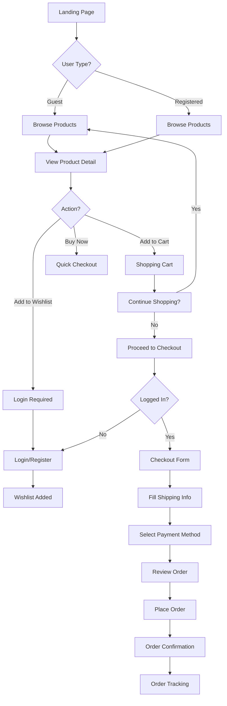
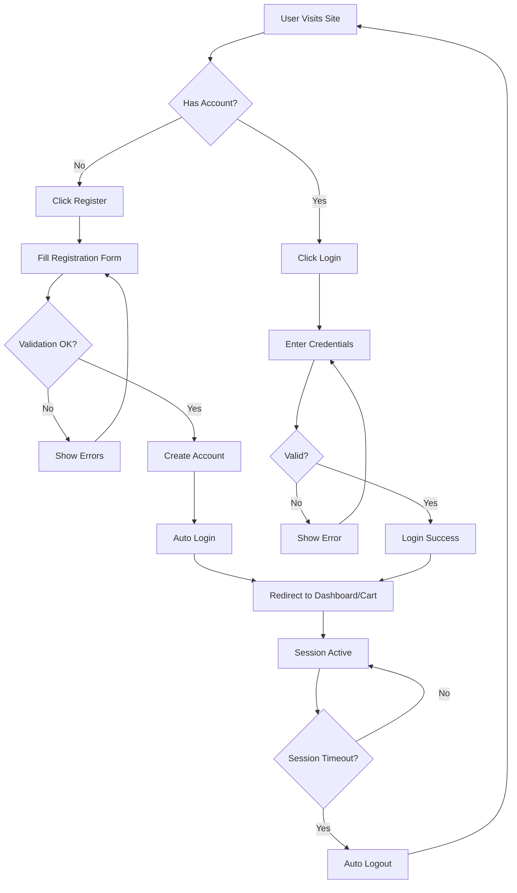
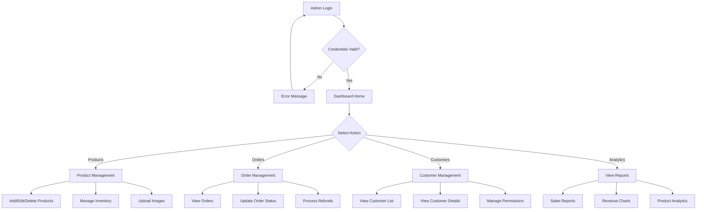
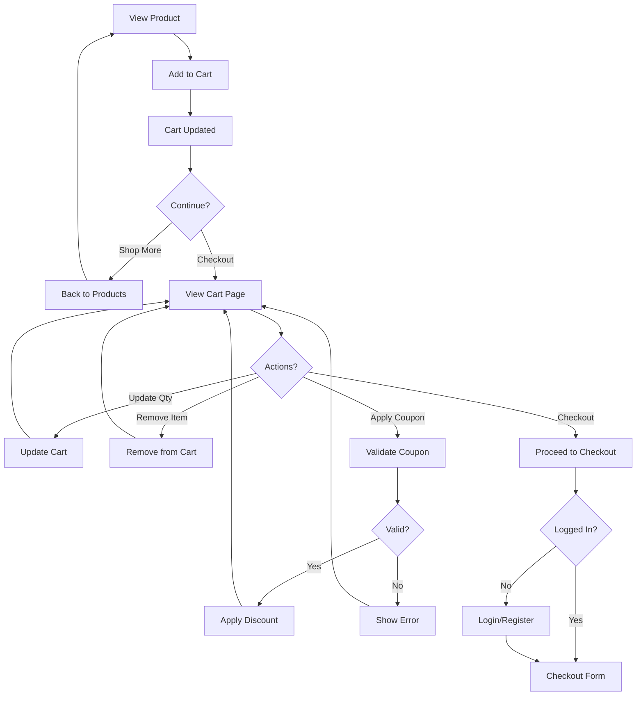
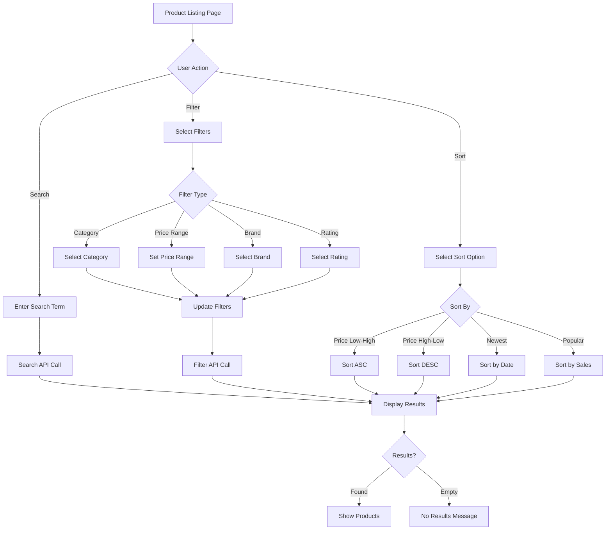
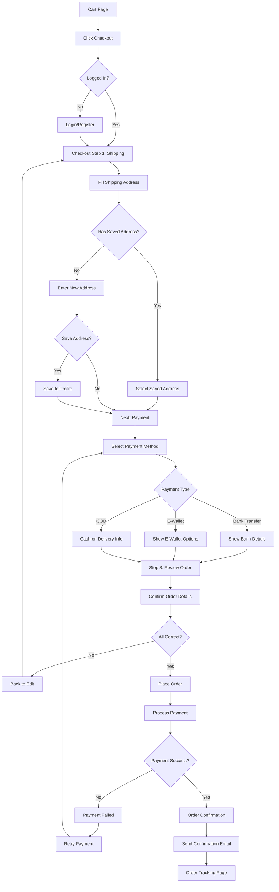

# User Flow - Nasional Elektronik E-commerce

## 1. Customer Journey - Browse & Purchase

## 2. User Authentication Flow

## 3. Admin Dashboard Flow

## 4. Shopping Cart Flow

## 5. Search & Filter Flow

## 6. Checkout Process Flow

## Key User Scenarios

### Scenario 1: First-Time Visitor
1. Lands on homepage
2. Sees hero banner with promotions
3. Browses featured products
4. Views product detail
5. Adds to cart
6. Prompted to register
7. Completes purchase

### Scenario 2: Returning Customer
1. Logs in
2. Checks wishlist
3. Moves item to cart
4. Uses saved shipping address
5. Quick checkout
6. Tracks order

### Scenario 3: Admin User
1. Logs into admin panel
2. Checks new orders
3. Updates order status
4. Manages product inventory
5. Views sales analytics
6. Responds to customer inquiries

## Pain Points to Address

- ✅ Minimize steps in checkout process
- ✅ Guest checkout option
- ✅ Save cart for later
- ✅ Easy returns/refunds process
- ✅ Clear shipping information
- ✅ Multiple payment options
- ✅ Real-time order tracking
- ✅ Mobile-responsive design

## Success Metrics

- Conversion rate: Add to cart → Purchase
- Cart abandonment rate
- Time to checkout completion
- Customer satisfaction score
- Return visitor rate
